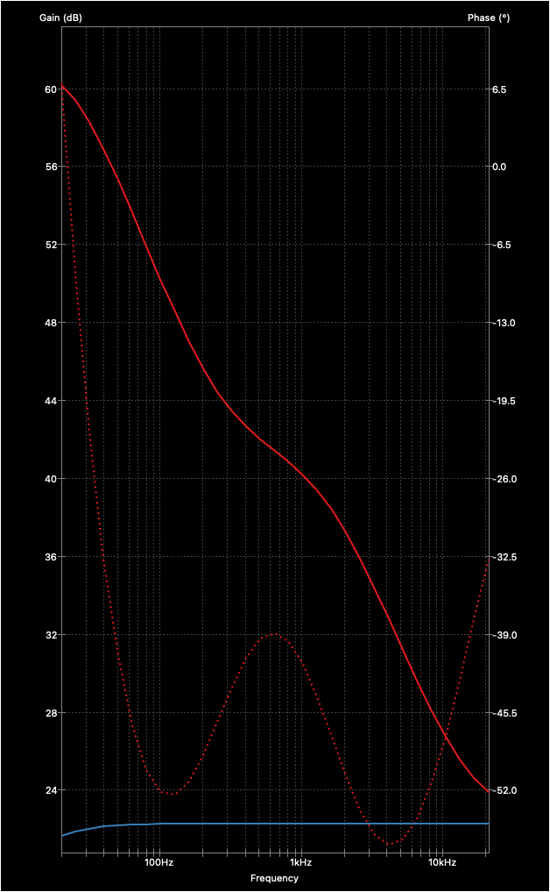

# Phono Amp

Phono Amp is a RIAA compliant pre-amplifier circuit that I built into my good old Dual 626, because my living room receiver does not provide phono level inputs.

It is a very simple and straighforward design. Using KiCad simulator, component values were optimized to preserve both a nice bottom end and brilliant treble on the output.

All simulation files are contained and available in this repository.

## Small Signal Analysis from KiCad simulation

## The final product mounted inside the Dual 626 turntable casing

